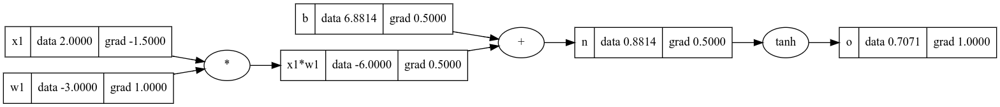

# Karpathy Lectures nn-zero-to-hero([link](https://github.com/karpathy/nn-zero-to-hero)) with complete exercises.


## Lecture 1: Micrograd
Micrograd is a tiny Autograd engine that implements backpropagation (reverse-mode autodiff),you will learn the fundamentals of automatic differentiation by building a scalar value autograd engine with only one class Value and using it to be able to create a small MLP.

code Example:
```python

#input
x1=Value(2.0,label='x1')
# weight w1
w1 = Value(-3.0, label='w1')
#bias
b = Value(6.8813735870195432, label='b')
#forward pass
x1w1=x1*w1;x1w1.label='x1*w1'
n=x1w1+b; n.label='n'

#activation function
o=n.tanh();o.label='o'
#backward pass
o.backward()
#draw graph
draw_dot(o)
```

## Lecture 2: Bigram 
Bigram is a language model and its an n-gram model for n=2,we are using one character to predict the next one,by looking at the counts of bigrams,and normalizing the rows the get probability distributions,and perform sampling of new words,evaluate the model via negative log likelihood.
 

code example:
```python
#generator to make everything deterministic 
g = torch.Generator().manual_seed(2147483647)
for i in range(1):
  out = []
  ix = 0
  while True:
    #get the probabilities 
    p = P[ix]
    #sample from the multinomial probability distribution
    ix = torch.multinomial(p, num_samples=1, replacement=True, generator=g).item()
    #integers to string 
    out.append(itos[ix])
    #if ix ==0 means end of the word 
    if ix == 0:
      break
  print(''.join(out))

```
Neural network approach:first construct xs(feature) and ys(label),turn xs into one hot encoded vectors to feed to a neural net with shape for one char[1,27],it contains only one linear layer(x @ W) and a probability distribution.


